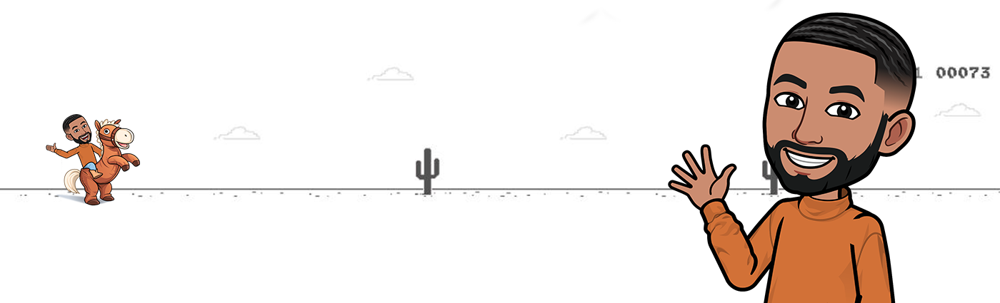

<h1 align="center">Morad Labrid - Lead Developer (Web & Mobile)</h1>

  

Hi there 👋 I'm Morad, a passionate lead developer specializing in web and mobile applications. Currently, I work at "L'Atelier de la Plateforme" where I lead and contribute to various exciting projects.

- 👨‍💻 Come and explore my repositories **[Here](https://github.com/moradlabrid?tab=repositories)**
- 💬 Ask me about **html, css, javascript, php, laravel, strapi, vue.js, react.js**
- 📫 How to reach me **[LinkedIn](https://www.linkedin.com/in/moradii.84)**
- ⚡ Passionate and Full of Energy and Ideas

## My Skills

- Web Technologies: HTML5, CSS3, JavaScript, PHP
- Frameworks: Laravel, Symfony, Strapi, Node.js, Express
- Frontend: Vue.js, Nuxt.js, React, React Native
- Databases: MySQL, MongoDB
- Design Frameworks: Tailwind CSS, Bootstrap, Materialize, Chart.js
- Version Control: Git
- Deployment: Heroku
- Operating Systems: Linux
- Design Tools: Figma, Sketch, Photoshop, Illustrator, Adobe XD

## Connect with Me

- [Facebook](https://www.facebook.com/moradii.84)
- [Instagram](https://www.instagram.com/moradii.84)
- [LinkedIn](https://www.linkedin.com/in/moradii.84)

Feel free to reach out to me if you have any questions or if you'd like to collaborate on exciting projects!

Happy coding! 😊
